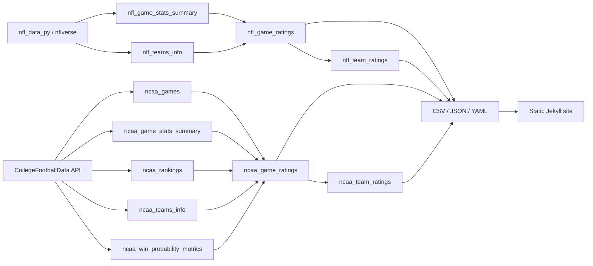

# Database documentation

PuntersLoveIt uses a single SQLite database at `_data/puntersloveit.db` as the
intermediate store for the NFL and NCAA data pipelines. The website does not
query this database at runtime. Pipeline scripts read and update SQLite, export
CSV, JSON, and YAML files into `_data/`, and Jekyll renders those exported files
into the static site.

The tables are populated by the Python data pipelines. Keys and relationships
described below are application-level relationships used by those scripts.

## Data flow

## Logical keys and relationships

| Parent | Child | Join | Cardinality |
| --- | --- | --- | --- |
| `nfl_game_stats_summary` | `nfl_game_ratings` | `game_id` | one row per game in each table |
| `nfl_teams_info` | `nfl_game_stats_summary` | `team_abbr = home_team` or `away_team` | one team to many games |
| `ncaa_games` | `ncaa_game_stats_summary` | `id` | zero or one stats row per game |
| `ncaa_games` | `ncaa_win_probability_metrics` | `id` | zero or one WP row per game |
| `ncaa_games` | `ncaa_game_ratings` | `id = game_id` | one computed rating per game |
| `ncaa_teams_info` | `ncaa_games` | `id = home_id` or `away_id` | one team to many games |
| `ncaa_rankings` | `ncaa_games` | `school`, `season`, `week`, `season_type` | zero or one AP rank per team and period |

The logical identifiers are `game_id` for NFL games and `id` for NCAA games.
Team rating rows are identified by `(season, team)`. NCAA ranking rows are
identified by `(school, season, week, season_type)`.

## NFL tables

### `nfl_teams_info`

Team lookup imported from `nfl_data_py.import_team_desc()`. A full NFL load
replaces the table. Incremental updates reuse the existing data.

| Column | SQLite type | Meaning |
| --- | --- | --- |
| `team_abbr` | `TEXT` | nflverse team abbreviation; logical team key |
| `team_name` | `TEXT` | display name used in ratings and exports |
| `team_color` | `TEXT` | source color in `#RRGGBB` form |

### `nfl_game_stats_summary`

One aggregated row per game, derived from play-by-play data. Raw plays are not
stored in SQLite.

| Column | SQLite type | Meaning |
| --- | --- | --- |
| `game_id` | `TEXT` | nflverse game identifier; logical game key |
| `season` | `INTEGER` | season year |
| `season_type` | `TEXT` | nflverse season type, such as `REG` or `POST` |
| `week` | `INTEGER` | source week number |
| `away_team`, `home_team` | `TEXT` | team abbreviations joining to `nfl_teams_info.team_abbr` |
| `total_home_score`, `total_away_score` | `REAL` | final scores |
| `qtr` | `REAL` | highest quarter value observed in play-by-play |
| `touchdown` | `REAL` | total touchdown events |
| `fumble_lost` | `REAL` | total lost-fumble events |
| `sack` | `REAL` | total sack events |
| `interception` | `REAL` | total interception events |
| `yards` | `REAL` | sum of yards gained |
| `leader_changes` | `INTEGER` | count of play-level changes in the sign of score differential |
| `win_chances_max_diff` | `REAL` | maximum minus minimum `vegas_home_wp` |
| `win_prob_shifts` | `REAL` | summed absolute WP movement across one-, two-, and three-play offsets |
| `scores_sum` | `REAL` | home score plus away score |
| `scores_diff` | `REAL` | absolute final-score difference |
| `overtime` | `INTEGER` | `1` when the highest quarter equals 5, otherwise `0` |

### `nfl_game_ratings`

One denormalized row per rated game. It contains the summary fields above,
display names and normalized colors, component ratings, and the final game
rating. This table is the source for both NFL game CSV exports.

The identity and game-stat columns match `nfl_game_stats_summary`, except that
`week` is `TEXT`: postseason rows contain `Playoff`, while regular-season rows
contain a numeric string. `home_team` and `away_team` contain full display names
rather than abbreviations.

| Rating column | SQLite type | Meaning |
| --- | --- | --- |
| `tds_rating` | `REAL` | touchdown component, capped at 10 |
| `sacks_rating` | `REAL` | sack component, capped at 10 |
| `interceptions_rating` | `REAL` | interception component, capped at 10 |
| `yards_rating` | `REAL` | nonlinear yardage component |
| `stat_rating` | `REAL` | weighted total of the four statistical components |
| `efficiency_rating` | `REAL` | nonlinear rating based on total points |
| `score_diff_rating` | `REAL` | rating based on final-score proximity |
| `win_prob_shifts_rating` | `REAL` | normalized WP volatility component |
| `win_chances_max_diff_rating` | `REAL` | normalized WP range component |
| `leader_changes_rating` | `INTEGER` | leader-change component, capped at 10 |
| `game_rating` | `REAL` | final watchability rating, rounded to two decimals |

The exact formulas and weights are documented in [README.md](README.md).

### `nfl_team_ratings`

Season-level rating for each team, rebuilt from all rows in
`nfl_game_ratings`. Home and away game means are calculated separately and then
averaged, so this is the mean of the two venue-specific means rather than a
direct mean of every game when the home/away counts differ.

| Column | SQLite type | Meaning |
| --- | --- | --- |
| `season` | `INTEGER` | season year |
| `team` | `TEXT` | full team name |
| `avg_game_rating` | `REAL` | team season watchability rating |
| `team_color` | `TEXT` | normalized display color |

## NCAA tables

### `ncaa_games`

One row per completed CFBD game involving the requested FBS classification.
This is the central NCAA fact table.

| Column | SQLite type | Meaning |
| --- | --- | --- |
| `id` | `INTEGER` | CFBD game identifier; logical game key |
| `season` | `INTEGER` | season year |
| `week` | `INTEGER` | source week number |
| `start_date` | `TEXT` | source kickoff timestamp |
| `season_type` | `TEXT` | `regular` or `postseason` |
| `completed` | `INTEGER` | SQLite boolean: `1` for completed games |
| `conference_game` | `INTEGER` | SQLite boolean indicating a conference game |
| `excitement_index` | `REAL` | CFBD excitement index |
| `notes` | `TEXT` | source game label or note |
| `home_id`, `away_id` | `INTEGER` | CFBD team identifiers joining to `ncaa_teams_info.id` |
| `home_team`, `away_team` | `TEXT` | source school names |
| `home_conference`, `away_conference` | `TEXT` | conference at game time |
| `home_division`, `away_division` | `TEXT` | team classification, normally `fbs` or `fcs` |
| `home_points`, `away_points` | `INTEGER` | final scores |
| `home_line_scores`, `away_line_scores` | `TEXT` | Python-style string representation of per-period score lists |
| `scores_sum` | `INTEGER` | home points plus away points |
| `scores_diff` | `INTEGER` | absolute final-score difference |
| `score_changes` | `INTEGER` | changes between home lead, away lead, and tie at period boundaries |
| `number_of_quarters` | `INTEGER` | number of entries in the home line-score list |

### `ncaa_game_stats_summary`

One row per game when CFBD team statistics are available. Values are totals for
both teams, produced by summing the two team records returned by CFBD.

| Column | SQLite type | Meaning |
| --- | --- | --- |
| `id` | `INTEGER` | CFBD game identifier joining to `ncaa_games.id` |
| `rushingTDs` | `REAL` | combined rushing touchdowns |
| `puntReturnTDs` | `REAL` | combined punt-return touchdowns |
| `passingTDs` | `REAL` | combined passing touchdowns |
| `kickReturnTDs` | `REAL` | combined kick-return touchdowns |
| `interceptionTDs` | `REAL` | combined interception-return touchdowns |
| `totalFumbles` | `REAL` | combined fumbles |
| `defensiveTDs` | `REAL` | combined defensive touchdowns; currently not included in `totalTDs` |
| `sacks` | `REAL` | combined sacks |
| `interceptions` | `REAL` | combined interceptions |
| `rushingYards` | `REAL` | combined rushing yards |
| `netPassingYards` | `REAL` | combined net passing yards |
| `totalYards` | `REAL` | combined total yards used by rating calculation |

### `ncaa_rankings`

AP Top 25 snapshots. Only the `AP Top 25` poll is extracted from each CFBD
ranking response.

| Column | SQLite type | Meaning |
| --- | --- | --- |
| `rank` | `INTEGER` | AP position |
| `school` | `TEXT` | school name used to join games |
| `season` | `INTEGER` | season year |
| `week` | `INTEGER` | ranking week |
| `season_type` | `TEXT` | `regular` or `postseason` |

### `ncaa_teams_info`

CFBD team metadata. A full load replaces this table and downloads the primary
logo locally when it is missing.

| Column | SQLite type | Meaning |
| --- | --- | --- |
| `id` | `INTEGER` | CFBD team identifier; logical team key |
| `school` | `TEXT` | school display name |
| `mascot` | `TEXT` | mascot name |
| `abbreviation` | `TEXT` | team abbreviation |
| `classification` | `TEXT` | division classification |
| `color`, `alt_color` | `TEXT` | source team colors |
| `logo1`, `logo2` | `TEXT` | source logo URLs |

### `ncaa_win_probability_metrics`

Pregame balance proxy used in the current NCAA rating formula. CFBD returns one
pregame home win probability. The pipeline converts it into two NFL-shaped
metrics: `game_balance = max(0, 1 - abs(home_wp - 0.5) * 2)`, then stores
`win_chances_max_diff = game_balance` and
`win_prob_shifts = game_balance * 40`.

| Column | Intended type | Meaning |
| --- | --- | --- |
| `id` | `INTEGER` | CFBD game identifier joining to `ncaa_games.id` |
| `win_chances_max_diff` | `REAL` | normalized pregame balance in the range 0–1 |
| `win_prob_shifts` | `REAL` | balance proxy in the range 0–40 |

### `ncaa_game_ratings`

One denormalized row per rated game. It joins the central game row to statistics,
WP metrics, AP rankings, and team metadata. Missing numeric inputs are filled
with the median of the calculation batch, or zero when no median exists.

| Column group | Columns |
| --- | --- |
| Identity and period | `game_id`, `season`, `week`, `season_type` |
| Source context | `excitement_index`, `notes` |
| Home team | `home_id`, `home_team`, `home_mascot`, `home_abbreviation`, `home_color`, `home_rank`, `home_conference`, `home_division` |
| Away team | `away_id`, `away_team`, `away_mascot`, `away_abbreviation`, `away_color`, `away_rank`, `away_conference`, `away_division` |
| Statistical components | `tds_rating`, `sacks_rating`, `interceptions_rating`, `yards_rating`, `stat_rating` |
| Game components | `efficiency_rating`, `overtimes_rating`, `excitement_rating`, `score_diff_rating`, `leader_changes_rating` |
| Result | `game_rating` |

`game_id`, team IDs, season, week, and `overtimes_rating` are `INTEGER`;
`season_type` and descriptive team fields are `TEXT`; source indexes, ranks,
colors, and computed components use `REAL` or `TEXT` according to the SQLite
schema.

The table keeps raw team names and numeric weeks. Export preparation later adds
AP rank suffixes to names and converts postseason week labels to `Bowls` without
writing those presentation changes back to SQLite.

### `ncaa_team_ratings`

Season-level ratings for FBS teams only. As with NFL, home and away means are
computed separately and then averaged.

| Column | SQLite type | Meaning |
| --- | --- | --- |
| `season` | `INTEGER` | season year |
| `team` | `TEXT` | school name |
| `avg_game_rating` | `REAL` | team season watchability rating |
| `team_color` | `TEXT` | normalized display color |
| `conference` | `TEXT` | conference selected from the season's game rows |
